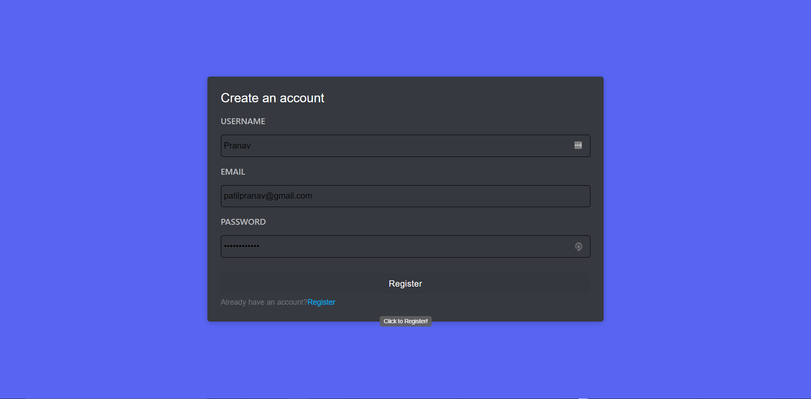
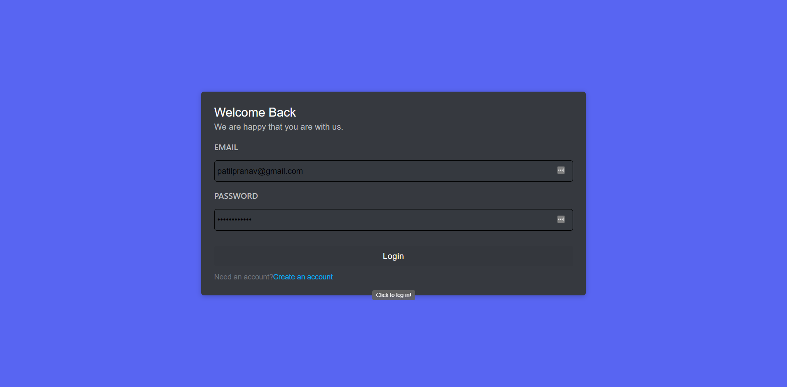
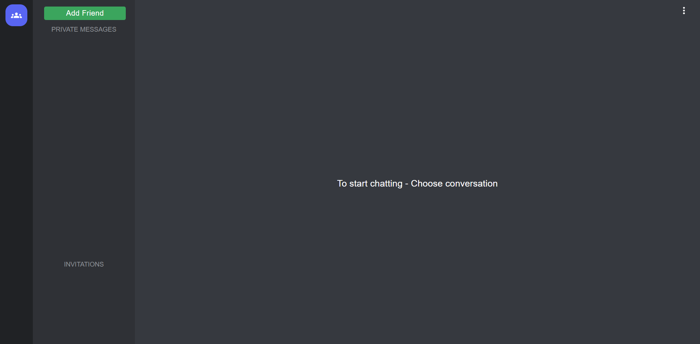
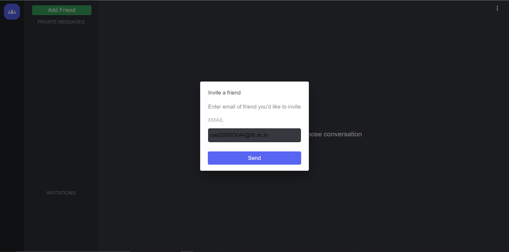

# iNotebook - Your Personal Notes App

- Website Link - https://discord-clone915.herokuapp.com

## Description :

- Discord Clone is a web app similar to discord that allows you to connect with your friends and chat with them.
- Secure Authentication
- Chat Functionality
- Sending & Receiving Friend Requests

## Tech Stack :

- HTML
- CSS
- React.js
- Node.js
- Express.js
- Mongoose
- Socket.io
- MongoDB
- JSON Web Token
- Bootstrap

## **Images** :

### Sign Up
- Don't forget to make a strong password with capital letters & special characters!
- Entering a valid email & strong password will enable the register button

### Login

### Dashboard

### Add new friend

- Click on the add new friend button to send a invite.
- Then enter the email id of the person you want to send the friend request & click Send.

### Confirm Invitation

- The person you send the request will receive a friend request in the pending request section.
- The request can be accepted or denied.

### New Friend

- After accepting the invitation a new friend will be added in your friends list.
- Click on the username to chat with the user.

### Chat

- You can chat now!

